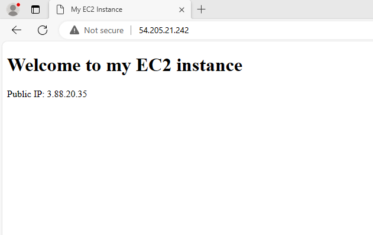
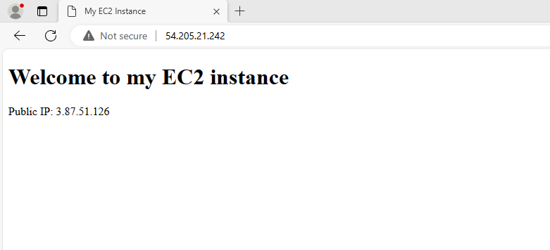

# Automating-Load-balance-Configuration-with-Nginx
Load balancing with Nginx involves distributing incoming network traffic across multiple servers to ensure optimal resource utilization, maximize throughput, minimize response time, and avoid server overload. Nginx acts as a load balancer, efficiently managing requests and distributing them among a group of backend servers, improving the overall performance and reliability of a web application. This process can be automated via shell scripting.

## Launch two EC2 instances
Amazon Elastic Compute Cloud (EC2) provides resizable compute capacity in the cloud. EC2 instances are virtual machines that can be launched in the cloud. They are available in different instance types optimized to fit different use cases. Each instance type comprises varying combinations of CPU, memory, storage, and networking capacity, allowing you to choose the appropriate mix of resources for your application

## Edit Inbound Rule 
Inbound rules are firewall rule that control the incoming network traffic to a device. Inbound rules are used to allow or block traffic based on the source IP address, destination IP address, port number, and protocol type. They are typically used to protect devices from unauthorized access from the internet or other networks. To achieve our objective, We open port 8000 to allow traffic from anywhere using the security group.

## Connect webserserver to terminal via the SSH client

Open the "install.sh" file using the vi text editor with administrative privileges (sudo)

## Apache2 Script

This script automates the installation and configuration of Apache webserver to listen on port 8000. The script takes the public IP of the EC2 instance as the first argument.
The execution steps of the script:

Copy the script to EC2 instance

Open a terminal window on the local machine

Navigate to the directory where the script is stored

Use the following command to run the script:

./install_configure_apache.sh <public_ip>

The, <public_ip> is the public IP address of EC2 instance

Create a simple HTML page that displays the public IP address of the EC2 instance.

##Make Install.sh Executable

This command gives execute permission to the "install.sh" script. This command allows the script to be executed as a program

## Run Apache shell script

This command,  ./install.sh PUBLIC_IP ,
execute the "install.sh" script with a parameter PUBLIC_IP. When a script is ran with parameters, it typically means the script expects some input or arguments during execution. 
The syntax ./install.sh PUBLIC_IP suggests the script might be designed to take a public IP address as an argument. In this case, you're passing the value PUBLIC_IP as the argument.
Now proceed to the url and type the ip address on the url

First EC2 instance IP (Apache webserver A)

Second EC2 instance IP (Apache webserver B)

## Nginx Automation
NOW Launch the third EC2 instance for the loadbalancer: Nginx

Edit Nginx inbound rule and add Port 80.

This command edit the "nginx.sh" file using the vi text editor with administrative privileges (sudo)
## Nginx shell script
The bash script "configure_nginx_loadbalancer.sh" automates the configuration of Nginx as a load balancer. The script takes three command-line arguments: the public IP of the EC2 instance where Nginx is installed, and the URLs of two web servers for which the load balancer distributes traffiC.
The execution steps of the script:

Command-line Argument Validation-
First Checks if the required command-line arguments are provided.
Exits the script with an error message if any argument is missing

Debug Mode and Error Handling-
Enables debug mode (set -x) to print each command before executing it.
Sets the script to exit if there is an error (set -e).
Sets the script to exit if there is a pipe failure (set -o pipefail)

Update and Install Nginx-
Updates the package list (apt update -y).
Installs Nginx (apt install nginx -y).

Nginx Status check
Checks the status of the Nginx service.

If Nginx is installed successfully (sudo systemctl status nginx returns 0), the script creates an Nginx configuration file (loadbalancer.conf) in the /etc/nginx/conf.d/ directory.
The configuration file specifies an upstream block with the provided web server URLs.
The Nginx server block listens on port 80 and uses the specified public IP for the load balancer.
The location block proxies requests to the backend_servers.
Nginx Configuration Validation:

Checks the Nginx configuration syntax (nginx -t).
Restart Nginx:

Restarts Nginx to apply the new configuration (systemctl restart nginx).

## Execute Command
 
This command gives execute permission to the "nginx.sh" script. it allows the script to be executed as a program

## Run Nginx shell script
./nginx.sh PUBLIC_IP Webserver-1 Webserver-2
This command run the "nginx.sh" script with specific command-line arguments. The script expects three specific arguments: the public IP of the EC2 instance, and the URLs of the two Apache2 web servers.

Now proceed to the url and type Nginx server IPaddred on the url

Take note of the IP on the url and the chage in IP address in the text

